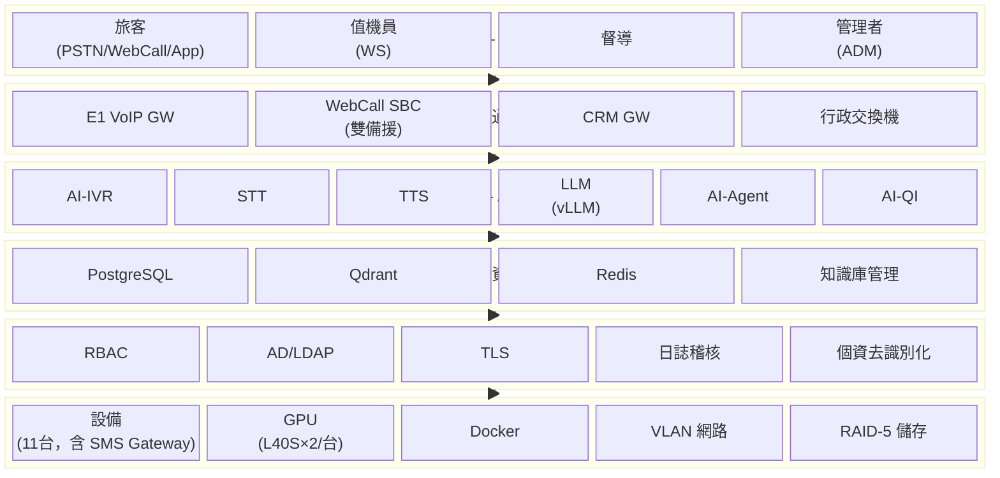
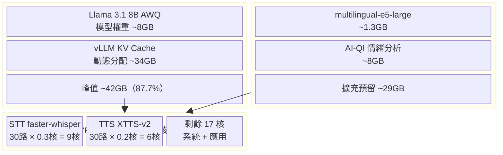
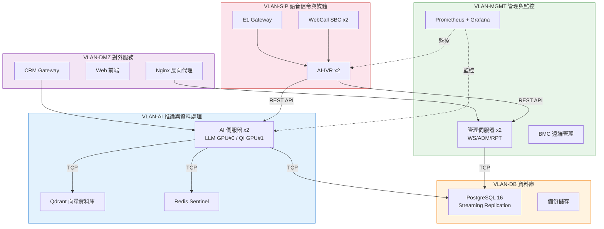
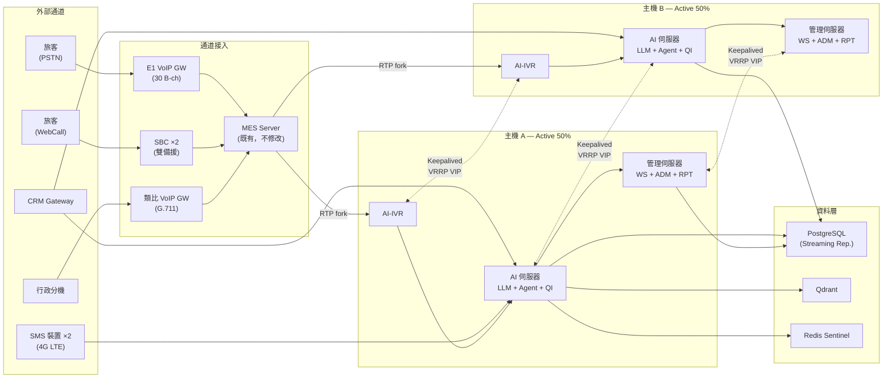
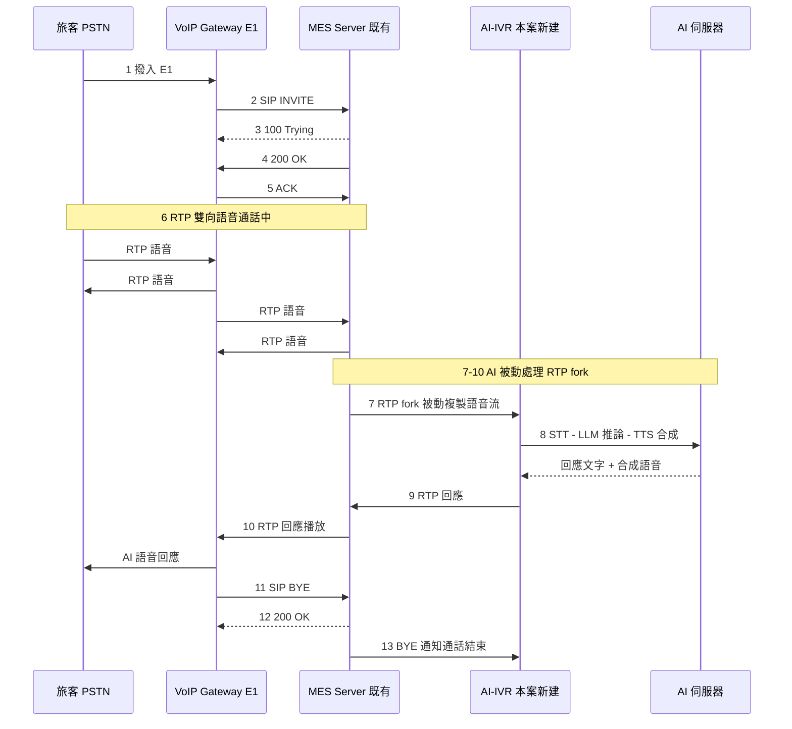
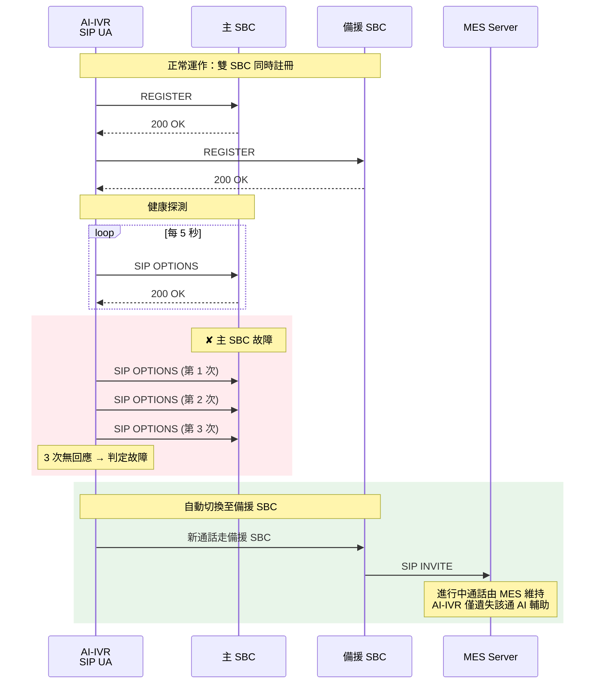

# #06 軟硬體清單及系統架構圖

**案號：** L0215P2010U ｜ **版本：** 1.0 ｜ **日期：** 中華民國 115 年
**國營臺灣鐵路股份有限公司 AI 客服系統建置案**

## 目錄

- 6.1　文件概述與適用範圍
- 6.2　正式環境硬體清單
  - 6.2.1　硬體交貨清單對照表
  - 6.2.2　GPU 同等品認定基準
  - 6.2.3　產品規格佐證資料清單
- 6.3　測試環境硬體清單
- 6.4　軟體清單與授權證明
  - 6.4.1　系統軟體
  - 6.4.2　AI 框架與模型
  - 6.4.3　資料庫與中介軟體
  - 6.4.4　應用框架與通訊
  - 6.4.5　監控與運維
- 6.5　第三方元件列冊與合規聲明
  - 6.5.1　第三方元件合規總表
  - 6.5.2　大陸關聯元件合規分析
- 6.6　電力與散熱需求估算
  - 6.6.1　正式環境
  - 6.6.2　測試環境
  - 6.6.3　散熱與 UPS 需求
- 6.7　系統架構圖 — 邏輯架構
  - 6.7.1　六層式架構全景
  - 6.7.2　GPU 資源分工
  - 6.7.3　十大子系統邊界
- 6.8　系統架構圖 — 網路拓撲
  - 6.8.1　VLAN 隔離設計
  - 6.8.2　HA 雙機網路配置
  - 6.8.3　正式環境網路拓撲概要
- 6.9　系統架構圖 — SIP/RTP 信令流程
  - 6.9.1　E1 語音通話信令序列
  - 6.9.2　WebCall SBC 雙備援 Failover

## 6.1　文件概述與適用範圍

本章完整列冊台鐵 AI 客服系統正式環境與測試環境之全部軟硬體項目，包含：硬體交貨清單（契約規格 vs. 實配對照）、產品規格佐證資料清單、軟體授權證明、第三方元件列冊，以及邏輯架構、實體部署與網路拓撲之系統架構圖。

本文件對應第二章 §2.1 六層式架構（AD-001）與第三章 §3.9 部署架構設計，所有數字與規格均引用自 decisions.yaml 單一真實來源。

**適用原則：**

- 所有設備須為決標日前 1 年內出產之新品
- 禁止大陸地區品牌及大陸地區製造之軟硬體
- 電源供應器一律冗餘設計（RPS）
- AI 伺服器應保留擴充空間與介面
- 合約期限內（含保固）零件供應無虞

## 6.2　正式環境硬體清單

### 6.2.1　硬體交貨清單對照表

下表逐台逐項對照契約規格與實際配置，供驗收時逐項勾稽。

**表 A：設備基本資訊**

| 項次 | 設備類型 | 數量 | 推薦品牌/型號 | 產地 |
|------|---------|------|-------------|------|
| 1 | AI-IVR 伺服器 | 2 台 | Dell PowerEdge R660 或 HPE ProLiant DL360 Gen11 | 美國設計／台灣/墨西哥組裝 |
| 2 | AI 伺服器 | 2 台 | Dell PowerEdge R760xa 或 HPE ProLiant DL380a Gen11 | 美國設計／台灣組裝 |
| 3 | 管理/資安監控伺服器 | 2 台 | Dell PowerEdge R660 或 HPE ProLiant DL360 Gen11 | 美國設計／台灣/墨西哥組裝 |
| 4 | SMS 簡訊收發裝置 | 2 台 | 台灣品牌 SMS Gateway（4G LTE+，LTE 模組須為非大陸製造） | 台灣 |
| 5 | 42U 標準機櫃 | 1 座 | 寬 ≥800mm，深 ≥1200mm，含理線架、PDU、風扇模組 | 台灣 |

（續上表，依項次對照）

**表 B：契約規格明細**

| 項次 | CPU | RAM | 儲存 | GPU | 電源 |
|------|-----|-----|------|-----|------|
| 1 | 16 核心 ≥2.2GHz ×2 | DDR5 64GB+ | 960GB SSD ×3（RAID-5） | — | 800W RPS ×2 |
| 2 | 16 核心 ≥3.0GHz ×2 | DDR5 128GB+ | 960GB SSD ×3（RAID-5） | NVIDIA L40S 48GB ×2 | 1000W RPS ×2 |
| 3 | 16 核心 ≥3.0GHz ×2 | DDR5 64GB+ | 960GB SSD ×3（RAID-5） | — | 800W RPS ×2 |
| 4（SMS） | 無（內建 4G LTE 模組） | 無 | 256GB+ | — | LTE 模組內建電源 |
| 5（機櫃） | 無 | 無 | — | — | PDU 冗餘設計（詳見 §6.8.1） |

**附註：**

- 所有伺服器均配置 GbE ×4 網路介面與 BMC 遠端管理模組
- 所有伺服器支援 RAID 0/1/5/6/10，本案採 RAID-5 配置
- SMS 裝置之 4G LTE 模組品牌與產地須於交貨時提供原廠證明，確認非大陸品牌/製造（如：採用 Sierra Wireless（加拿大）或 u-blox（瑞士）模組）

### 6.2.2　GPU 同等品認定基準

本案指定 NVIDIA L40S 48GB 或同等品，同等品須同時符合下列三項基準：

| 基準項目 | 最低要求 | L40S 原廠規格 |
|---------|---------|--------------|
| VRAM 容量 | ≥48GB | 48GB GDDR6 ECC |
| FP16 推論效能 | ≥362 TFLOPS | 362.05 TFLOPS |
| 品牌/產地 | 非大陸品牌且非大陸製造 | NVIDIA（美國設計／台灣製造） |

同等品驗證方式：以 vLLM 引擎執行 Llama 3.1 8B AWQ 推論 benchmark，throughput 須達 L40S 基準值之 95% 以上。詳見 #01 工作計畫書 §1.10 同等品認定策略。

### 6.2.3　產品規格佐證資料清單

交貨時須隨附下列佐證資料，供驗收勾稽：

| 佐證項目 | 內容 | 驗證方式 | 特別說明 |
|---------|------|---------|---------|
| 原廠型錄 | 每台設備之官方產品規格書（PDF） | 核對 CPU/RAM/Storage/GPU 是否符合契約規格 | 所有伺服器與設備均適用 |
| 產地證明 | 製造商出具之原產地證明書 | 確認非大陸地區製造 | 所有伺服器與設備均適用 |
| **SMS 裝置 LTE 模組產地證明** | **4G LTE 模組製造商與品牌證明** | **原廠 Certificate of Origin（COO）**，**確認模組品牌為 Sierra Wireless（加拿大）或 u-blox（瑞士）等非大陸品牌** | **必須於交貨前取得，缺此無法驗收** |
| 序號清冊 | 每台設備之序號（S/N）、MAC Address、BMC IP | 建立資產台帳，供保固追蹤 | 所有伺服器與設備均適用 |
| 出廠日期證明 | 原廠出廠證明或發票 | 確認為決標日前 1 年內新品 | 所有伺服器與設備均適用；SMS 裝置包含 LTE 模組 |
| 保固證明 | 原廠保固卡或代理商保固承諾書 | 確認合約期限內零件供應無虞 | 所有伺服器與設備均適用 |
| GPU 效能報告 | vLLM benchmark 測試報告（若採同等品） | 驗證推論效能達 L40S 之 95% | 僅 AI 伺服器適用 |

## 6.3　測試環境硬體清單

**表 A：設備基本資訊**

| 項次 | 設備類型 | 數量 | 推薦品牌 | 產地 |
|------|---------|------|---------|------|
| 1 | AI-IVR 測試伺服器 | 1 台 | Dell / HPE | — |
| 2 | AI 測試伺服器 | 1 台 | Dell / HPE | — |
| 3 | SMS 測試裝置 | 1 台 | 同正式環境 | — |
| 4 | 42U 機櫃 | 1 座 | 寬 ≥800mm，深 ≥1200mm | — |

（續上表，依項次對照）

**表 B：規格明細**

| 項次 | CPU | RAM | 儲存 | GPU | 電源 |
|------|-----|-----|------|-----|------|
| 1 | 8 核心 ≥2.2GHz ×2 | DDR5 64GB+ | 600GB SAS ×3 | — | 800W RPS ×2 |
| 2 | 8 核心 ≥2.2GHz ×2 | DDR5 64GB+ | 600GB SAS ×3 | L40S ×1 | 1000W RPS ×2 |
| 3 | — | — | 256GB+ | — | — |
| 4 | — | — | — | — | — |

測試環境採正式環境之縮減配置，CPU 核心數減半（16C→8C），GPU 單卡（2→1），足以驗證功能正確性與單路效能基線。壓力測試（30 路並行）須於正式環境執行。

## 6.4　軟體清單與授權證明

本案技術選型全面採用開源方案（AD-008），契約到期後無授權費續約問題，可繼續使用到期前最後更新版本。

### 6.4.1　系統軟體

| 項次 | 軟體名稱 | 版本 | 用途 | 授權類型 | 授權費用 | 到期續用說明 |
|------|---------|------|------|---------|---------|-------------|
| 1 | Ubuntu Server | 22.04 LTS | 作業系統 | 免費（Canonical 社群版） | $0 | 社群版免費永久使用，LTS 安全更新至 2027 年 |
| 2 | Docker Engine | 24.0+ | 容器引擎 | Apache 2.0 | $0 | 開源永久使用 |
| 3 | Docker Compose | 2.20+ | 容器編排 | Apache 2.0 | $0 | 開源永久使用 |
| 4 | NVIDIA Container Toolkit | 最新穩定版 | GPU 容器支援 | Apache 2.0 | $0 | 開源永久使用 |

### 6.4.2　AI 框架與模型

| 項次 | 軟體/模型名稱 | 版本 | 用途 | 授權類型 | 授權費用 | 備案方案 |
|------|-------------|------|------|---------|---------|---------|
| 1 | vLLM | 0.5+ | LLM 推論引擎 | Apache 2.0 | $0 | — |
| 2 | Llama 3.1 8B-Instruct AWQ | 3.1 | 大型語言模型（AD-004） | Meta Llama 3.1 Community License | $0 | Llama 3.1 70B-Instruct AWQ 4-bit（~36GB VRAM） |
| 3 | faster-whisper | 最新穩定版 | STT 語音辨識引擎 | MIT | $0 | Whisper 社群 fork |
| 4 | Whisper large-v3 | large-v3 | STT 模型（AD-003） | MIT | $0 | — |
| 5 | Coqui TTS（XTTS-v2） | 最新穩定版 | TTS 語音合成（AD-003） | MPL 2.0 | $0 | MeloTTS / Piper |
| 6 | multilingual-e5-large | 最新穩定版 | 中文向量嵌入模型 | MIT | $0 | gte-large（thenlper，MIT 授權） |

**開源軟體風險管控：** Coqui AI 公司已於 2023 年底停業，XTTS-v2 模型以 MPL 2.0 授權開源，原始碼與模型權重可永久使用。備案方案 MeloTTS（MIT 授權）及 Piper（MIT 授權）已完成可行性驗證，必要時可於 2 週內完成切換。所有開源元件之原始碼納入第十一項交付物（原始程式碼光碟），確保台鐵保有完整原始碼副本。詳見 #01 工作計畫書 §1.8 開源軟體管理策略之備案方案矩陣。

### 6.4.3　資料庫與中介軟體

| 項次 | 軟體名稱 | 版本 | 用途 | 授權類型 | 授權費用 |
|------|---------|------|------|---------|---------|
| 1 | PostgreSQL | 16 | 關聯式資料庫 | PostgreSQL License（類 BSD） | $0 |
| 2 | TimescaleDB | 最新穩定版 | 時序資料擴展（日誌/監控指標） | Apache 2.0（社群版） | $0 |
| 3 | Qdrant | 最新穩定版 | 向量資料庫（RAG 語意檢索） | Apache 2.0 | $0 |
| 4 | Redis | 7 | 快取（Session + 對話上下文） | BSD-3-Clause | $0 |

### 6.4.4　應用框架與通訊

| 項次 | 軟體名稱 | 版本 | 用途 | 授權類型 | 授權費用 |
|------|---------|------|------|---------|---------|
| 1 | Python | 3.11+ | 後端開發語言 | PSF License | $0 |
| 2 | FastAPI | 最新穩定版 | 後端 Web 框架（REST + gRPC） | MIT | $0 |
| 3 | PJSIP（pjsua2） | 最新穩定版 | SIP/RTP 通訊堆疊（AD-007） | GPL-2.0 | $0 |
| 4 | React | 18+ | 前端框架 | MIT | $0 |
| 5 | Next.js | 最新穩定版 | 前端 SSR 框架 | MIT | $0 |
| 6 | Material UI（MUI） | 5.x | 企業級 UI 元件庫 | MIT | $0 |
| 7 | Nginx | 最新穩定版 | 反向代理 / 負載平衡 | BSD-2-Clause | $0 |
| 8 | Keepalived | 最新穩定版 | HA VRRP 心跳 / VIP 管理（AD-005） | GPL-2.0 | $0 |

### 6.4.5　監控與運維

| 項次 | 軟體名稱 | 版本 | 用途 | 授權類型 | 授權費用 |
|------|---------|------|------|---------|---------|
| 1 | Prometheus | 最新穩定版 | 指標蒐集與告警引擎 | Apache 2.0 | $0 |
| 2 | Grafana | 最新穩定版（OSS 版） | 監控儀表板 | AGPL-3.0 | $0 |
| 3 | Loki | 最新穩定版 | 日誌聚合 | AGPL-3.0 | $0 |

## 6.5　第三方元件列冊與合規聲明

### 6.5.1　第三方元件合規總表

| 元件名稱 | 版本 | 授權類型 | 開發組織 | 組織所在地 | 是否含大陸元件 |
|---------|------|---------|---------|----------|-------------|
| Llama 3.1 | 3.1 | Meta Community License | Meta Platforms | 美國 | 否 |
| Whisper large-v3 | large-v3 | MIT | OpenAI | 美國 | 否 |
| XTTS-v2 | 最新 | MPL 2.0 | Coqui AI（已停業，模型開源） | 德國 | 否 |
| multilingual-e5-large | 最新穩定版 | MIT | Microsoft | 美國 | 否 |
| vLLM | 0.5+ | Apache 2.0 | UC Berkeley + 社群 | 美國 | 否 |
| faster-whisper | 最新 | MIT | Guillaume Klein + 社群 | 法國 | 否 |
| Qdrant | 最新 | Apache 2.0 | Qdrant Solutions GmbH | 德國 | 否 |
| PostgreSQL | 16 | PostgreSQL License | PostgreSQL Global Dev Group | 國際 | 否 |
| Redis | 7 | BSD-3 | Redis Ltd. | 以色列/美國 | 否 |
| PJSIP | 最新 | GPL-2.0 | Teluu Inc. | 美國 | 否 |
| React / Next.js | 18+ / 最新 | MIT | Meta / Vercel | 美國 | 否 |
| Material UI（MUI） | 5.x | MIT | MUI SAS | 法國 | 否 |

### 6.5.2　大陸關聯元件合規分析

**向量嵌入模型：** 本案預設採用 multilingual-e5-large（Microsoft，美國，MIT 授權），部署於台鐵機房進行地端推論，無任何對外連線需求。原評估之 bge-large-zh-v1.5（北京智源，MIT 授權）因開發組織屬大陸地區，依契約§8(24)規定不予採用；如未來機關以書面同意函確認開源元件不適用該條款，可作為替代選項，切換僅需修改 Embedding 服務容器之模型路徑參數，預計 1 個工作日內完成。

**前端 UI 元件庫：** 本案採用 Material UI（MUI，MUI SAS，法國，MIT 授權），以 npm 套件引入進行前端開發，所有前端程式碼經編譯後為靜態 JavaScript/CSS 檔案，部署於台鐵機房。原評估之 Ant Design（螞蟻集團，MIT 授權）因開發組織屬大陸地區，依契約§8(24)規定不予採用。

## 6.6　電力與散熱需求估算

本節提供精確之電力與散熱數據，供台鐵機房環境評估。

### 6.6.1　正式環境

| 設備 | 數量 | 單台最大功耗（W） | 合計功耗（W） |
|-----|------|----------------|-------------|
| AI 伺服器（含 L40S ×2，TDP 350W/卡） | 2 | ~2,000 | 4,000 |
| AI-IVR 伺服器 | 2 | ~800 | 1,600 |
| 管理/資安監控伺服器 | 2 | ~800 | 1,600 |
| SMS 裝置 + 網路設備 | — | — | ~300 |
| **小計** | | | **7,500** |
| **含 20% 餘裕** | | | **~9,000** |

### 6.6.2　測試環境

| 設備 | 數量 | 合計功耗（W） |
|-----|------|-------------|
| AI 測試伺服器（含 L40S ×1） | 1 | ~1,500 |
| AI-IVR 測試伺服器 | 1 | ~600 |
| SMS 測試裝置 + 網路設備 | — | ~200 |
| **小計** | | **~2,300** |
| **含 20% 餘裕** | | **~2,800** |

### 6.6.3　散熱與 UPS 需求

| 項目 | 正式環境 | 測試環境 |
|-----|---------|---------|
| 散熱需求（BTU/hr） | ~30,700（9,000W × 3.412） | ~9,600（2,800W × 3.412） |
| 建議 UPS 容量（kVA） | ≥12 kVA（含 20% 餘裕） | ≥4 kVA |
| 電力迴路 | 建議獨立 220V/30A 迴路 ×2（互為備援） | 獨立 220V/20A 迴路 ×1 |

機房環境需求已納入第一章工作計畫書之機關配合事項，須於 D+30 前與台鐵機房管理單位確認電力餘裕與空調容量。

## 6.7　系統架構圖 — 邏輯架構

### 6.7.1　六層式架構全景

本系統採六層式架構（AD-001），由下而上為：

| 層級 | 名稱 | 主要元件 | 說明 |
|------|------|---------|------|
| 第六層 | 使用者層 | 旅客（PSTN/WebCall/App）、值機員（WS）、督導、管理者（ADM） | 各類使用者透過不同通道存取系統 |
| 第五層 | 通道接入層 | E1 VoIP GW、WebCall SBC（雙備援）、CRM GW、行政交換機 | 語音與文字通道之接入閘道 |
| 第四層 | AI 服務層 | AI-IVR、STT、TTS、LLM（vLLM）、AI-Agent、AI-QI | AI 核心服務模組 |
| 第三層 | 資料管理層 | PostgreSQL、Qdrant、Redis、知識庫管理、對話紀錄 | 結構化與非結構化資料儲存 |
| 第二層 | 平台安全層 | RBAC、AD/LDAP、TLS、日誌稽核、個資去識別化 | 存取控制與資安防護 |
| 第一層 | 基礎設施層 | 伺服器、GPU、Docker、網路（VLAN）、儲存（RAID-5） | 硬體與虛擬化基礎設施 |

**圖 6.7.1　六層式架構全景圖**

此分層設計將 AI 模組與既有系統完全隔離，AI-IVR 透過 SIP/RTP fork 被動接收語音流（AD-007），不修改 MES Server 任何設定，達成零衝擊介接目標。

### 6.7.2　GPU 資源分工

依 AD-002 決策，雙卡 GPU 採專責分工避免資源搶奪：

| GPU | 專責任務 | 預估 VRAM 佔用 | 備註 |
|-----|---------|---------------|------|
| GPU #0 | LLM 推論（vLLM + Llama 3.1 8B AWQ） | 模型權重 ~8GB + KV Cache 動態分配，峰值 ~42GB | 專責即時推論，確保 ≤5 秒回應 SLA |
| GPU #1 | Embedding（multilingual-e5-large）+ AI-QI 批次分析 + 擴充預留 | ~1.3GB + ~8GB + 預留 | 批次任務與預留空間 |

**圖 6.7.2　GPU / CPU 資源分工圖**

STT（faster-whisper）與 TTS（XTTS-v2）均以 CPU 推論（AD-003），部署於 AI-IVR 伺服器，不佔用 GPU 資源。30 路 STT 串流推論約需 9 個 CPU 核心，AI-IVR 伺服器配置 32 核心，餘裕充足。

### 6.7.3　十大子系統邊界

| 子系統代碼 | 名稱 | 部署位置 | 主要資料流 |
|-----------|------|---------|----------|
| AI-IVR | 智慧語音應答 | AI-IVR 伺服器 | RTP 語音 → STT → LLM → TTS → RTP |
| STT | 語音辨識 | AI-IVR 伺服器（CPU） | 語音串流 → 文字 |
| TTS | 語音合成 | AI-IVR 伺服器（CPU） | 文字 → 語音串流 |
| LLM | 大型語言模型 | AI 伺服器（GPU #0） | 查詢文字 → 回應文字 |
| AI-Agent | AI 虛擬客服 | AI 伺服器 | CRM GW 文字 → LLM → 回應文字 |
| SMS | 簡訊服務 | SMS 裝置 | 簡訊收發 + AI 自動回覆 |
| AI-QI | 智慧質檢 | AI 伺服器（GPU #1） | 錄音 → STT → 分析報告 |
| WS | 值機平台 | 管理伺服器 | 座席操作 + AI 知識輔助 |
| ADM | 管理後台 | 管理伺服器 | 系統設定 + 監控儀表板 |
| RPT | 查詢及報表 | 管理伺服器 | 統計分析 + 匯出報表 |

## 6.8　系統架構圖 — 網路拓撲

### 6.8.1　VLAN 隔離設計

依循第二章 §2.13 網路安全設計，正式環境採五段式 VLAN 隔離（AD-001）：

| VLAN | 名稱 | 涵蓋範圍 | 存取規則 |
|------|------|---------|---------|
| VLAN-SIP | 語音信令與媒體 | AI-IVR 伺服器、E1 Gateway、WebCall SBC | 僅允許 SIP/RTP 埠號 |
| VLAN-AI | AI 推論與資料處理 | AI 伺服器、Qdrant、Redis | 僅允許 gRPC/API 內部埠號 |
| VLAN-MGMT | 管理與監控 | 管理伺服器、Prometheus/Grafana、BMC | BMC IPMI + 管理 API，僅限管理者 IP |
| VLAN-DMZ | 對外服務 | 反向代理、Web 前端、CRM Gateway | HTTPS 443 |
| VLAN-DB | 資料庫 | PostgreSQL、備份儲存 | 僅允許 DB 連線埠 |

**圖 6.8.1　VLAN 五段式網路隔離架構圖**

跨 VLAN 存取須經防火牆規則控管，資料網段禁止直接對外連線。

### 6.8.2　HA 雙機網路配置

依 AD-005 決策，正式環境採 Active-Active + Failover 架構：

| 節點 | 角色 | 負載分配 | 監控機制 | 切換條件 |
|------|------|---------|---------|---------|
| 主機 A | Active | 50% 流量 | Keepalived VRRP 心跳 + VIP（虛擬 IP） | 故障偵測至 VIP 漂移 ≤5 秒，存活機承載 100% |
| 主機 B | Active | 50% 流量 | Keepalived VRRP 心跳 + VIP（虛擬 IP） | 故障偵測至 VIP 漂移 ≤5 秒，存活機承載 100% |
| Redis 同步 | 雙機共享 | — | 雙機間 Session 持久化同步 | 任一台故障不遺失對話上下文 |

- **正常運作：** 雙機各承載 50% 流量，SIP 層以 Round-Robin 分配新通話，HTTP 層以 Nginx 反向代理負載平衡
- **故障切換：** Keepalived VRRP 心跳偵測間隔 ≤2 秒，故障偵測至 VIP 漂移完成 ≤5 秒，存活機自動承載 100% 流量
- **Session 持久化：** Redis 共享 Session 存取，任一台故障不遺失對話上下文
- 系統異常時可立即切換為人工客服系統，AI-IVR 停止介入不影響 MES 原始通話路徑

### 6.8.3　正式環境網路拓撲概要

| 來源 | 通道 | 中繼設備 | 目的 | 協定 |
|------|------|---------|------|------|
| PSTN（旅客撥入） | E1 | VoIP Gateway → MES Server | AI-IVR（×2, HA） | RTP fork（被動複製） |
| WebCall（網頁通話） | SIP | SBC（×2, 備援） → MES Server | AI-IVR（×2, HA） | SIP/RTP |
| 行政分機 | 類比 | VoIP GW（G.711） → MES Server | AI-IVR（×2, HA） | RTP |
| AI-IVR | 內部網路 | — | AI 伺服器（×2, HA）[LLM/Agent/QI] | REST API |
| AI-IVR | 內部網路 | — | 管理伺服器（×2, HA）[WS/ADM/RPT] | REST API |
| AI 伺服器 + 管理伺服器 | 內部網路（VLAN-DB） | — | 資料層（PostgreSQL / Qdrant / Redis） | TCP |
| CRM Gateway | REST/WebSocket | — | AI-Agent → LLM | REST/WebSocket |
| SMS 裝置（×2） | 4G LTE | — | AI-Agent（自動回覆同步通知值機平台） | 4G LTE |

**圖 6.8.3　正式環境網路拓撲全景圖**

AI-IVR 以 RTP fork 方式被動接收語音流，不攔截、不修改原始通話路徑，MES Server 無需任何設定變更。

## 6.9　系統架構圖 — SIP/RTP 信令流程

### 6.9.1　E1 語音通話信令序列

詳細 SIP 信令交換時序如下，對應 AD-007 決策與第二章 §2.9 語音整合架構：

**圖 6.9.1　E1 語音通話 SIP/RTP 信令時序圖**

| 步驟 | 發送方 | 接收方 | 訊息/媒體 | 說明 |
|------|--------|--------|----------|------|
| 1 | 旅客（PSTN） | VoIP Gateway | 撥入（E1） | 旅客透過 PSTN 撥入 |
| 2 | VoIP Gateway | MES Server | SIP INVITE | 發起 SIP 通話請求 |
| 3 | MES Server | VoIP Gateway | 100 Trying | 通話處理中 |
| 4 | MES Server | VoIP Gateway | 200 OK | 通話建立成功 |
| 5 | VoIP Gateway | MES Server | ACK | 確認通話建立 |
| 6 | 旅客 ↔ VoIP Gateway ↔ MES Server | （雙向） | RTP 雙向語音 | 語音通話進行中 |
| 7 | MES Server | AI-IVR | RTP fork | 被動複製語音流，不攔截不修改 |
| 8 | AI-IVR | （內部處理） | STT 辨識 → LLM 推論 → TTS 合成 | AI 語音辨識、推論與合成 |
| 9 | AI-IVR | MES Server | RTP 回應 | AI 合成語音回傳 |
| 10 | MES Server ↔ VoIP Gateway | 旅客 | RTP 回應播放 | AI 語音回應播放給旅客 |
| 11 | VoIP Gateway | MES Server | SIP BYE | 結束通話 |
| 12 | MES Server | VoIP Gateway | 200 OK | 確認通話結束 |
| 13 | MES Server | AI-IVR | BYE | 通知 AI-IVR 通話結束 |

### 6.9.2　WebCall SBC 雙備援 Failover

AI-IVR 之 SIP UA 同時向主備兩台 SBC 註冊，當主 SBC 故障時自動切換：

**圖 6.9.2　WebCall SBC 雙備援 Failover 時序圖**

- 主 SBC 無回應超過 3 次 SIP OPTIONS 探測（間隔 5 秒），判定故障
- SIP UA 自動向備援 SBC 發起 REGISTER
- 切換期間進行中的通話由 MES 維持，AI-IVR 僅遺失該通之 AI 輔助功能，不中斷通話本身
- SBC failover 具體機制（VIP-based 或 DNS-based）須於需求訪談階段與既有廠商確認

## 6.10　SMS 儲存容量估算

依需求書要求，SMS 簡訊紀錄須保留 ≥5 年：

| 參數 | 數值 |
|-----|------|
| 月均簡訊量 | 2,500 ~ 7,000 則 |
| 年均簡訊量（取上限） | 84,000 則 |
| 5 年總量 | 420,000 則 |
| 每則平均儲存大小（含 metadata） | ~2 KB |
| 5 年儲存需求 | ~840 MB |
| SMS 裝置儲存容量 | 256GB+（餘裕 >99%） |

256GB 儲存空間對 5 年 SMS 資料保留綽綽有餘，額外空間可用於本機日誌備份。

## 6.11　引用編號清單

### 功能需求（FR）
FR-IVR-001、FR-IVR-002、FR-LLM-001、FR-AGT-001、FR-AGT-007、FR-QI-001

### 測試案例（TC）
TC-IVR-001、TC-IVR-002、TC-LLM-001、TC-AGT-001、TC-AGT-007、TC-QI-001

### 架構決策（AD）
AD-001（六層式架構）、AD-002（GPU 分工）、AD-003（STT/TTS CPU 推論）、AD-004（Llama 3.1 8B AWQ）、AD-005（HA Active-Active）、AD-006（Docker Compose 部署）、AD-007（SIP/RTP fork 介接）、AD-008（全開源技術選型）

### 攻擊面防禦（ATK）
ATK-012（機房電力散熱/GPU 功耗 → §6.6）、ATK-015（開源授權/社群活躍度/備案方案 → §6.4.2）、ATK-021（SMS 裝置品牌產地 → §6.2.1 附註）、ATK-022（GPU 同等品認定 → §6.2.2）、ATK-024（文件格式合規 → 全文）

*本章引用之所有數字、規格與品牌推薦均來自 decisions.yaml 單一真實來源，未經四捨五入或改寫。*

